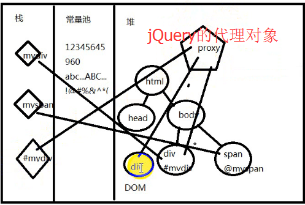
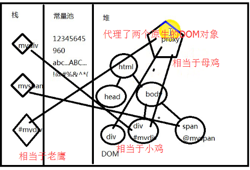
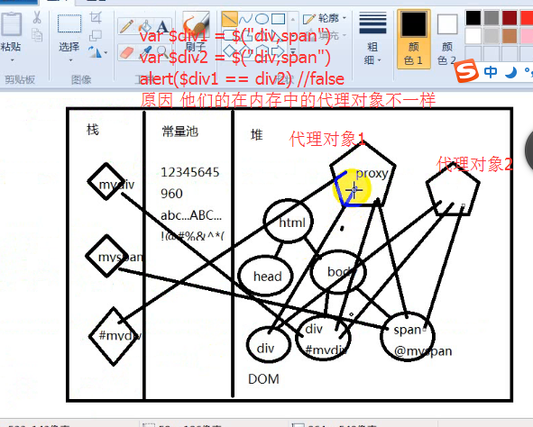

**开班典礼：**

---

**新知识点：**

**1.程序流程详解**

**2.JQuery概念**

- `javascript`概念：
   - 基于`Js`语言的`API`和语法组织【逻辑】，通过内置`window`和`document`对象，来操作内存中的`DOM`元素
- JQuery概念：
   - 基于`javascript`的，同上，【提高了代码的效率】
    
- a.选择器引擎返回代理对象
- c.操作代理对象批量操作`dom`(`attr`、`style`、`class`...)以及`dom`树结构(`append`、`before`、`after`...)
- d.事件
- e.动画
- f.`ajax`

- `var jQuery==$ =function(){}` `$`本质就是一个函数 也就是`jQuery`的核心函数

- 只要是`jQuery`的对象都这样变量加上一个`$` 方便识别：`var $div = $("#");`

- 找代理中的原生对象 通过代理去找 `$divele.get(num)`

- `jQuery`中返回的是代理对象本身

- `jQuery`的核心原理是通过选择器找到对应的代理对象

-  `jQuery`全都是通过方法操作

**3.选择器引擎规则**($('字符串'))

- a.css选择器的规则

 - 标签选择器
 - id选择器
 - 类选择器
 - 混合选择器

- b.`css3`的选择器规则
- c.状态和伪类（`:even` `:odd` `:first` `:last` `:eq(index)`）
- d.属性（`[attr=value]`）

**4.对象转换**(`$(element)`)
   
- e.原生dom对象和jquery代理对象的相互转换 
    
**例如**：

```javascript
$(传入的原生对象);
//原生对象转化成jQuery对象
var nav = document.getElementById("nav");
var $nav = $(nav);
alert($nav.get(0) == nav);//true
```

**5.检索范围的限制**（`$('字符串',element)`）

**6.代理模式以及代理内存结构**

**7.`dom`和`jquery-proxy`操作**

---

- **总结：三种写法对比**：

- **方式一：不推荐 搜索速度最慢**
 - `$("#nav").css();`
 - `$("#nav li").css();`

- **方式二：搜索速度最快 链式操作**
 - `$("#nav").css().children().css();`

- **方式三：也常用 速度第二快**
 - `var $nav = $("#nav").css();`
 - `$("li".$nav).css();`// $nav 限制了搜索范围 速度快


---





