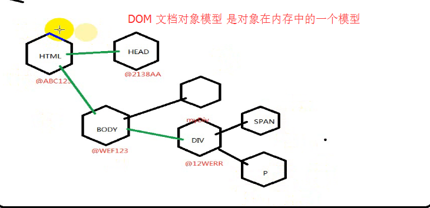
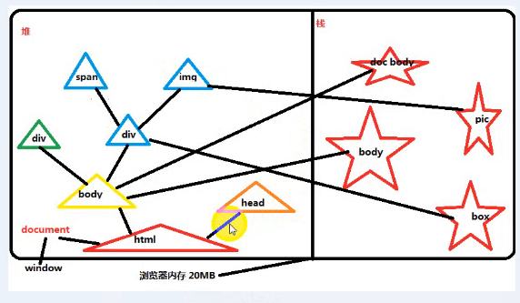
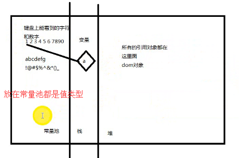
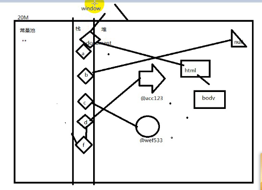

### 开班典礼：

**知识点：**

- 操作系统就是个应用程序
- 只要是应用程序都要占用物理内存
- 浏览器本身也是一个应用程序

- 浏览器本身只懂得解析HTML
- 调用浏览器这个应用程序的一个功能绘制

**1、javascript介绍**

- 目的：就是用来操作内存中的DOM节点

  - 修改DOM节点的属性
  - 过javascript语法组织逻辑代码操作DOM
  - BOM(window)它包含了DOM
  - DOM(document)
  - script脚本推荐放在最下边好处：防止因网络问题，页面加载时间长，出现空白；即便网络问题，浏览器也把DOM加载渲染完成，等待从服务端下载完js脚本，出现效果
  - css不放在最下面原因是：好比先穿好衣服在出去，浏览器先把css样式准备好，在加载结构层，使得页面有样子；如果放在下面，因为页面是从上往下加载，没有css，就剩下裸露的标签，很难看，使得用户体验不好

**2、基于对象的内存管理**

**3、变量**

变量本质是一个空盒子，里面记录了一个内存地址，使能找到内存中的对象，保存了指向具体的实在的东西的地址

变量存在栈中，对象存在堆中

变量的意义：方便我们去操作对象

- 指针（C语言中叫法）
- 引用（Java）
- 变量

var b = document.body  含义：把body这个对象在内存中的地址放到b变量里面，变量b（b是内存地址的别名）本身也存在内存中，以后的操作是针对body这个地址

等于符号，在小学里是等于的意思，在程序里，代表的是赋值把等号右边的值，赋予给左边这个变量 ==两个对象的地址都相等 比较的是对象地址

- 变量命名规范

  + 由字母(a-zA-Z)数字(0-9)下划线(_)以及美元符号($)
  + 不能由数字开头
  + 命名尽量用英文并且具有一定的含义
  + 如果有多个英文单词,后面单词的首字母大写
  + 不能使用关键字
  + 首字母不要大写，大写是有特殊含义的

**4、数据类型**

**5、作业：**

- 写出20-30个命名合法的变量
- 根据简单的HTML代码画内存图（简单的画图工具）至少5遍

---

DOM:

