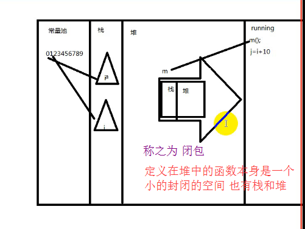
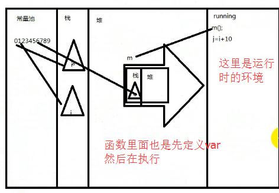
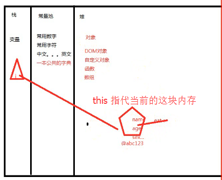

**回顾：**

**1、switch**

- `switch case break default` 条件   判断 退出  默认

    - a.只要匹配上一个case，那么它下面的所有的case都会执行包括default
    - b.break的意思跳出当前结构

**2、for**

- 循环有三个要素

    - a.循环变量
    - b.判断条件（循环体）
    - c.改变循环变量
    - d.continue的意思结束本次循环进入下次循环

---

**知识点：**

1、while/do...while 没有谁好谁坏 只有适应场景不同

- 比如：先吃饭 在买单 `do..while` 用户体验高 有风险  扫雷游戏也是先体验 在问是否退出 提高体验
- 比如：先买单 在吃饭 `while` 用户体验不高

- 一般情况下面，如果条件判断是`数字的`比较`==<>`，`for`循环优先.
- 如果是`非数值相关的`比较循环，`while`优先

2、**function函数**

3、**代码内存解析**

- **闭包**

   - a.程序永远是先定义后执行
   - b.执行永远从上到下
   - c.函数定义的话在堆（只是一个地址而已）
   - d.函数调用的时候，就会有自己的堆和栈（`闭包`）

---

- **闭包 作用域**

    + 记住：先定义`var`  `function`  在从上往下执行
    + 定义定义在自己的栈里面 执行在自己的堆里面
    + 运行在运行的环境中
    + 函数每调用前  只是一个地址
    + 只要调用一次函数就会动态开辟一块内存 创建一个封闭的空间 在自己的封闭的空间的栈中定义`var `在执行
    + 函数执行完 里面的东西全部销毁

```javascript
//alert(x);//9:执行弹出x,结果x没定义,错误.
alert(i);//9:执行弹出i,然而i之前已经定义,只不过没地址,因此是undefiend
var i = 10;//1:var i;    10:把常量池中10的地址赋给栈中的i
var j = "你好";//2:var j;   11:把常量池中 你好 的地址复给栈中的j
var k = z = null;//3:var k,z;  12:把堆中null的地址赋值给z和k
var m = function(){//4:var m;   5:function匿名函数  13:把匿名函数在堆中的地址赋给栈中的m
    alert(2);
}
var b = document.body;//6:var b;    14:把堆中document.body对象的地址赋给栈中的b
var f = true;//7:var f; 15:把常量池中true的地址赋给栈中的变量f
function m(){//8:function m;
    alert(1);
}

```


```javascript
function m(){
    c = 50;//在局部变量中找不到定义的c 沿着作用域链找到了全局变量的c
    alert('哈哈哈');
    //var c;
}

var c = 150; // 函数m()还未执行到 还没被销毁 此时全局c的值c=50
m();
var c = 20;//到这里一步 m()已经执行完了 函数已经销毁了  这里的c还是20
alert(c);//20

```
```javascript
function m(){
    c = 50;//在局部变量中找不到定义的c 沿着作用域链找到了全局变量的c
    alert('哈哈哈');
    function inner(){
        c = 30;
        alert('嘻嘻');
    }
    inner();//c在函数内部找不到定义 所以沿着作用域链找到了全局的c
}

var c = 20;//到这里一步 m()还没执行 函数没被销毁  这里的c是30
m();

alert(c);//30


```
---
4、**object对象**

5、**面向对象的程序设计**

- a.`function`构造器
- b.`prototype`原型
- c.`foreach`
- c.作用域
- d.继承

---

6、**API**

7、**BOM**

8、**DOM**

- API

9、**Jquery**

---




