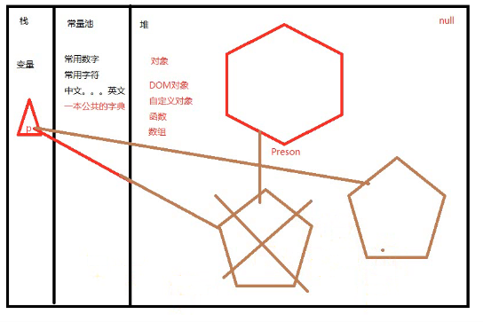

### lesson07

---

**回顾：**

+ 1.switch

+ 2.`while/do...while`

 + 一般情况下面，如果条件判断是数字的比较`==<>`，`for`循环优先.
 + 如果是非数值相关的比较循环，`while`优先

+ 3.`function`函数

+ 4.代码内存解析

    + **闭包**

        * a.程序永远是先定义后执行
        * b.执行永远从上之下
        * c.函数定义的话在堆（只是一个地址而已）
        * d.函数调用的时候，就会有自己的堆和栈（闭包）

---

**知识点：**

**1、object对象**

+ new关键字代表的是新开辟一块内存空间
+ 没有被引用的内存空间，会在适当的时候被销毁

    + 两句代码含义等同

        * `var person = new Object()`;
        * `var person = {};`

+ 访问对象的属性除了用 对象引用`.属性` `key`以外，还可以使用对象引用`[属性key]`

**2、面向对象的程序设计**

+ `function`构造器

  + **共同点:**

    + 动态创建一块内存空间，闭包

  + **不同点:**

    + 函数调用是没有办法拿到空间的地址的，而且这块地址是一块临时地址，执行完函数之后，就会销毁
    + `new`开辟内存空间，把这块空间的地址返回，这块空间就有可能长期的被引用

+ `prototype`原型

    + 通过原型使通过同样一个构造器所`new（创建）`出来的对象具有相同的属性和行为
    + `prototype`本质就是一个对象

+ `foreach`

+ `this` 指代当前创建的这块内存 `this.name=name` 指代当前内存中的这个name属性 接收外界传过来的值

+ `继承`

---

**其他：**

- 函数调用后一定有返回值，没有返回值就是undefined
---
**作业：**

+ 定义十个构造器函数

    - 人类（学生）
    - 狗
    - 电脑(笔记本) ...

+ 每个构造器的原型必须有至少5个以上的属性和3个以上的行为

---

