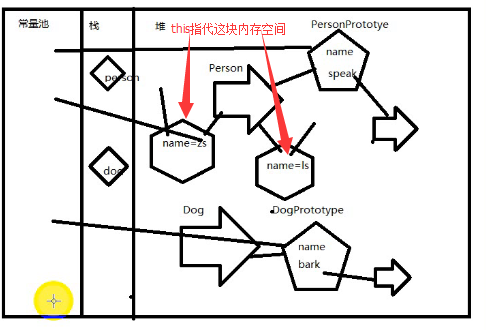
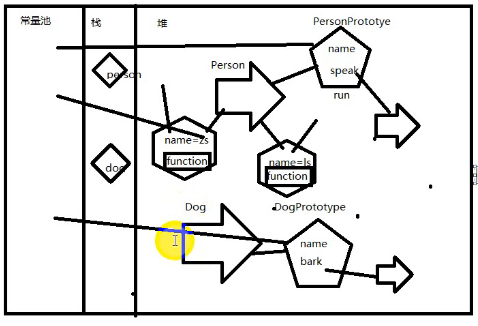

**回顾：**

**1.object对象**

- new关键字代表的是新开辟一块内存空间
- 没有被引用的内存空间，会在适当的时候被销毁

    - 两句代码含义等同

    `var person = new Object();`
    `var person = {};`

    - 访问对象的属性除了用 对象引用`.属性key`以外，还可以使用对象引用`[属性key]`

**2.面向对象的程序设计**

- a.`function`构造器

    - 共同点:

        - 动态创建一块内存空间，闭包

    - 不同点：

        - 函数调用是没有办法拿到空间的地址的，而且这块地址是一块临时地址，执行完函数之后，就会销毁

        - new开辟内存空间，把这块空间的地址返回，这块空间就有可能长期的被引用

- b.`prototype`原型

    - 通过原型使通过同样一个构造器所new（创建）出来的对象具有相同的属性和行为
    - `prototype`本质就是一个对象

- c.`foreach`

- c.`this`

- d.继承

---

**知识点：**

**1.prototype内存解析**

- `prototype`是原型，是一块所有对应构造器创建的对象都共享的内存空间
- 在面向对象设计程序的时候，属性应该是对应的空间的，而功能应该是`prototype`公共空间的

**2.通过prototype扩展功能**

- 所有的构造器都是继承于`Object`构造器的，因此只要`Object`的原型里有的功能，所有的对象都有

**3.封装**(面向对象程序设计过程)

- 1：找对象  小头爸爸  大头儿子  饭
- 2：抽象（类，构造器）
- 3：创建对象并且建立关系（操作对象）

**4.继承**

**5.面向对象程序设计案例（猜拳）**

**作业：**

- 用面向对象的思维设计十个生活中的场景案例


---

```javascript
//多个对象的构造 以及 多个对象之间如何建立联系
function Student(name,age,sex){
    this.name = name;
    this.age = age;
    this.sex = sex;

}

function Bingqilin(name){
    this.name = name;
}

function Game(name){
    this.name = name;
}
function Hour(time){
    this.time = time;
}
Student.prototype = {

    eat:function(b){
        alert(this.name+"喜欢吃"+b.name);
    },
    mess:function(){
        alert(this.name+"的信息："+this.age+','+this.sex);
    },
    sleep:function(h){
        alert(this.name+"每天睡,"+h.time+'小时');
    },
    work:function(h){
        alert(this.name+"每天工作,"+h.time+'小时');
    },
    like:function(g){
        alert(this.name+"喜欢打,"+g.name);
    }

}
var s = new Student("小明",22,"男");

var b = new Bingqilin("黑色的冰淇淋");
s.eat(b);//小明喜欢吃黑色的冰淇淋

var g = new Game("英雄联盟");
s.like(g);//把对象的地址发送给like的参数即可访问构造函数Game的name属性

var h = new Hour(10);
s.sleep(h);
s.work(h);
```

---


