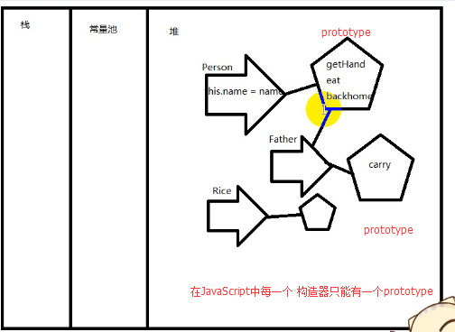
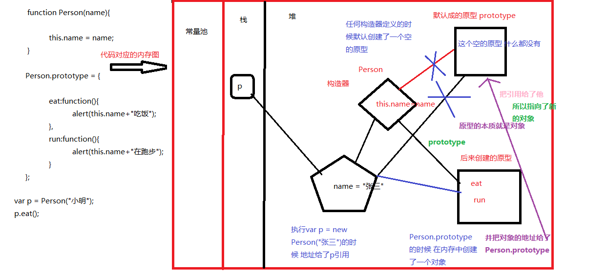

**回顾：**

**1、prototype内存解析**

- `prototype`是原型，是一块所有对应构造器创建的对象都共享的内存空间
- 在面向对象设计程序的时候，属性应该是对应的空间的，而功能应该是`prototype`公共空间的

**2、通过prototype扩展功能**

- 所有的构造器都是继承于`Object`构造器的，因此只要`Object`的原型里有的功能，所有的对象都有
- 构造器在定义的时候 就默认创建了一个空的原型

**3、封装**

- 1：找对象  小头爸爸  大头儿子  饭
- 2：抽象（类，构造器）
- 3：创建对象并且建立关系（操作对象）

---

**知识点：**

- 1.继承
- 2.面向对象程序设计案例（猜拳）

---

---

---

---

