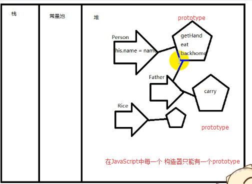
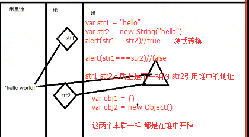

**回顾：**

**1.继承**

- 本质就是从一个`prototype`对象中把它的功能都`copy`到另一个`prototype`对象
- 继承为什么要循环

**2.面向对象程序设计案例（猜拳）**

- `func.call（obj）`：调用func的时候，以`obj`这个对象的作用域去调用
- 改变函数在调用的时候里面闭包的作用域

- `call(obj,arg1,arg2,arg3)`;`call`第一个参数传对象，可以是`null`。参数以逗号分开进行传值，参数可以是任何类型。
`apply(obj,[arg1,arg2,arg3])`;`apply`第一个参数传对象，参数可以是数组或者`arguments `对象

---

**知识点：**

**API application program interface**

- 第一：遇到问题
- 第二：查资料或者学习  -> 解决问题
- 第三：记住有这个功能
- 第四：查资料（百度）

- 1.`String`

- 2.`Array`

- 3.`Math Math.random();`

- 4.`Date`

- 5.`Regex`

---

**作业：**
1.操作字符串

---

```javascript
//在这个最大的对象的原型上加一个extends方法 使得下面所有的原型 都有这个方法
 //这个原型的作用是通过迭代 复制传进来的构造器的所有的原型的方法

 Object.prototype.extends = function(parent){
     //console.log(parent.prototype);

    for(var prop in parent.prototype){
        //console.log(prop);//eat extends
        this.prototype[prop] = parent.prototype[prop];//复制传进来的构造器的所有的原型的方法给当前正在调用这个方法的对象
    }
 }

 function Person(name){
    this.name = name;
 }
 Person.prototype = {
    eat:function(){
        alert(this.name+"在吃饭");
    }
 };

 function Father(name){
    this.name = name;
 }

 Father.extends(Person);//extends方法是最大的对象Object加的方法 所有的子孙 构造器都有这个方法

 var f = new Father("小头爸爸");
 f.eat();
```



---



