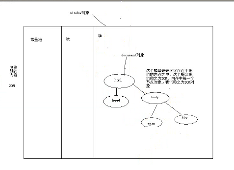

**回顾：**

- 1.Regex

       - a.`[]`一个字符的范围
       - b.有顺序要求的
       - c.`\w==[a-zA-Z0-9_]`  `\d==[0-9]`
       - d.`{count}`设置匹配数量比如`\w{5}`，`{c1,c2}`
       - e.`//`的正则表达式匹配局部，`/^$/`的正则表达式是匹配全部
       - f.`()`的作用就是为了分组匹配
       - g.+代表的是`1-N`个，`*`代表的是`0-N`个
       - h.?代表该字符要不没有要不就有一个
       - i.`.`代表的是任意字符
        -j.`\`转义符

---

**新知识：**

- `window` 是`Window`构造器造出来的一个对象 `alert(window instanceof Window)`
- `document` 是`Document`构造器造出来的一个对象

- 任何对象在我们的内存中他都是由某个构造器创建出来的 也就是说 有构造器一定有对应的原型prototype
- 例如：div是由HTMLDivElement 这个构造器创建的一个实例 `div = new HTMLDivElement()`  `span = new HTMLSpanElement()`

-查看某个对象对应的构造器：console.log();

- 整个浏览器的实现就是一个面向对象的编程思想 一切皆是对象
---

- 1.BOM 浏览器对象模型

       - a.`screen` 指的不是浏览器的宽度，指的是整个电脑屏幕的分辨率
            可以拿到屏幕可用分辨率

       - b.`navigator`
            可以通过`userAgent`判断当前浏览器信息

       - c.`location`

           - `URL`：统一资源定位符 `Union Resource Location`

           - 可以通过`href`属性重定向（改变）页面的URL，进行页面跳转

       - d.`history`
            go方法能够让我们进行历史回退或者前进

       - e.`frames`
            获得当前窗体的子页面（`iframe`）

       - f.`document`
            `DOM`模型的核心对象

- 2.`DOM` 文档对象模型

       - **`document`**

         + **功能**
            + `getElementById`   `$('#aaa')`
            + `getElementByTagName`  `$('div')`
            + `getElementsByClassName`  `$('.aaa')`
            + `getElementsByName`  只用在表单元素中

       - **`document` `object`**

         - **属性：**

            + `className`，`style`
            + `id`
            + `name`,`value`(表单元素)
            + `href`,`src`...(对应的元素)
            + `innerHTML`
            + `children`
            + `parentNode`

         + **功能方法：**

            + `setAttribute/getAttribute`
            + `appendChild`

---

