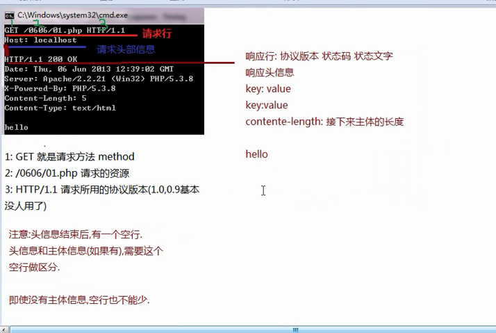
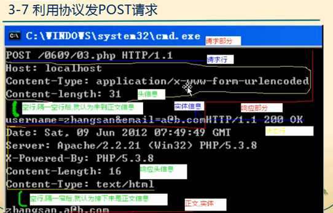
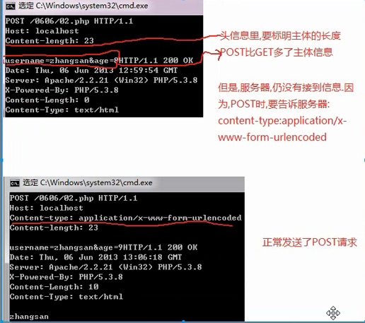

### HTTP请求信息和相应信息的格式

#### 请求：

- 请求行
- 请求头信息
- 请求主体信息（可以没有）
- 头信息结束和主体信息之间要空一行

#### 请求行又分三部分

- 请求方法

    - GET
    - POST
    - PUT
    - DELETE
    - TRACE
    - OPTIONS

- 请求路径：URL

- 所用协议：目前一般是HTTP/1.1 ,0.9\1.0已经不用

#### GET方法完成HTTP协议的请求

#### POST方法完成HTTP协议的请求

