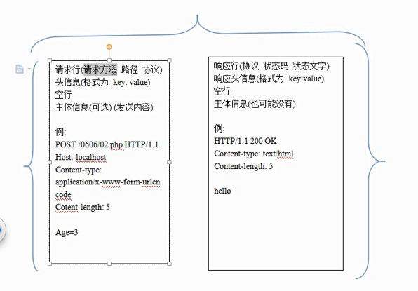

### HTTP协议之方法与状态码
---

### 总结
---

---

---
### 状态码 状态文字

- 状态码：用来反应服务器响应情况的
- 最常见的如：200 OK，404 NOTFOUND
- 状态文字是用来描述状态码的，便于人观察

#### 需要记忆的

- 200 服务器成功返回网页
- 301/302 永久/临时重定向
- 304 Not Modified 未修改

*失败的状态码*

- 404 请求的网页不存在
- 503 服务器暂时不可用
- 500 服务器内部错误

---

---

---
