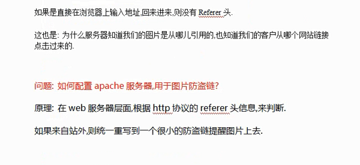
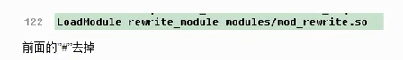
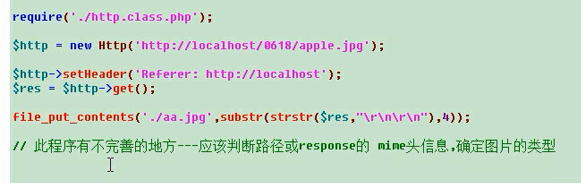

---



--
### 防盗链具体步骤：

- 打开Apache重写模块 mod_rewrite（打开Apache的httpd.conf 并吧前面的#去掉--并重启Apache）



- 在需要防盗链的网站或目录，写htaccess文件 并指定防盗链规则

#### 如何指定：

自然是分析referer信息 如不是来自本站 是重写

#### 重写规则

- 那种情况重写

 - 是jpeg/jpg/gif/png 图片时
 - 是refere头与localhost不匹配时重写

- 怎么重写：

 - 统一rewrite到某个防盗链图片

如下面的额例子：
```
RewriteEngine On
RewriteCond %{REQUEST_FILENAME} .*\.(jpgjpeg|gif|png)[NC]
RewriteCond %{HTTP_REFERER} !localhost [NC]
RewriteRule .* http://b.hiphotos.baidu.com/image/h%3D360/sign=a813da3172094b36c4921deb93ce7c00/810a19d8bc3eb135aa449355a21ea8d3fc1f4458.jpg
```



