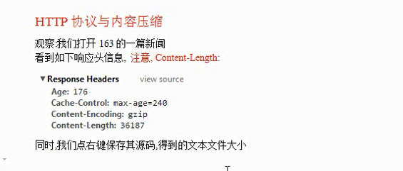
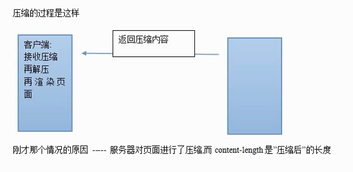
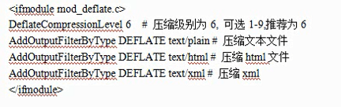
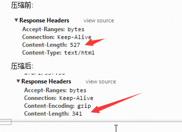
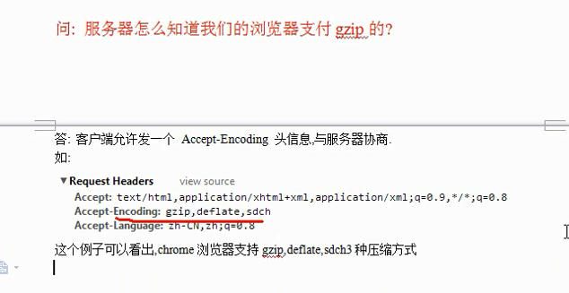
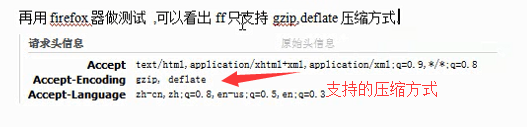

### HTTP协议与内容压缩

---

---

---

---

#### 如何在Apache启用压缩功能

- 开启gzip模块或deflate模块
- 在conf中写如下代码

---

---
#### 为什么要指定文件类型来压缩

- 压缩也是耗CPU资源的 图片/视频等文件 压缩效果也不好
- 一般压缩文本格式的文件

---

---

---

---

---
